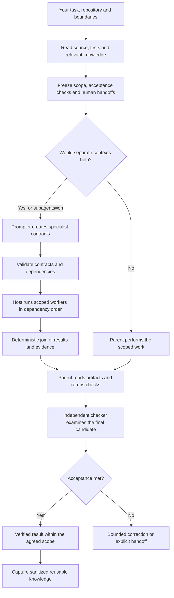
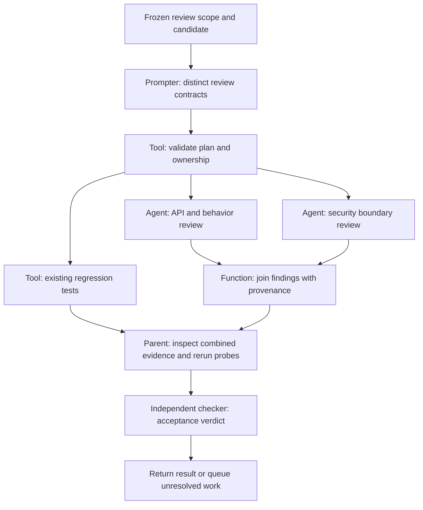
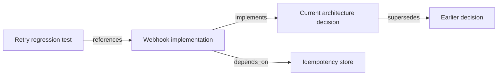
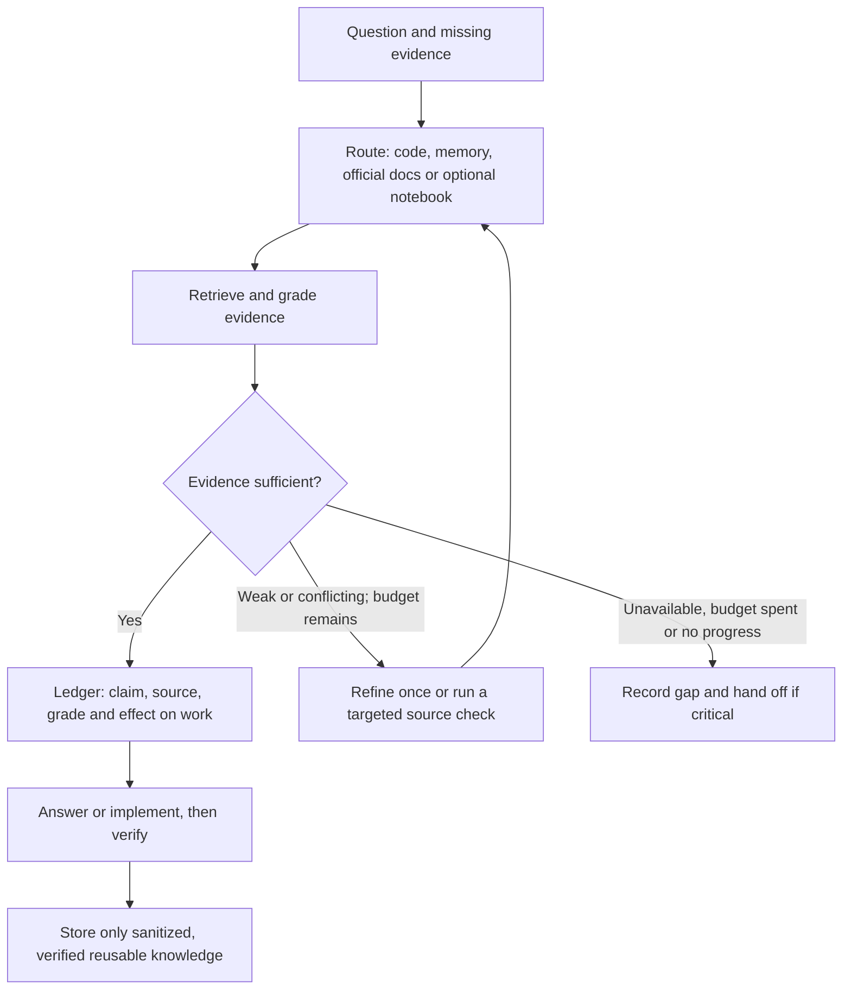

# ThinkTank V17

**An engineering workflow for Hermes One and Claude Code that turns a task into scoped work, tested results and an independent review.**
Built by [Martin Tomczak](https://tomczak.dev).

## What is ThinkTank?

ThinkTank is an open-source toolkit that runs inside your existing AI coding application. It gives
the agent a repeatable way to investigate a problem, retrieve relevant knowledge, divide work between
specialists when useful, execute changes and check the result against an agreed goal.

You supply the repository, task and boundaries. Your host application supplies the model and tools.
ThinkTank supplies **skills, specialist prompts, local memory, plan validators and safety hooks**.
It is not another model, a hosted AI service or a visual workflow builder.

For example, "make webhook retries safe" should produce an implementation, a test proving that
repeated delivery does not repeat the business action, and an independent review. If the environment
cannot prove that behavior, the result should say what is missing rather than call the task done.

### What you get

| Your need | ThinkTank's approach | Result you can inspect |
|---|---|---|
| Understand an unfamiliar project | Read current source and tests before recalling prior knowledge | Findings linked to files, commands and explicit gaps |
| Implement a feature or fix a defect | Agree on observable acceptance criteria; implement and run checks | Scoped changes, regression tests and actual command outcomes |
| Handle work across several domains | Generate task-specific prompts with dependencies and exclusive ownership | Specialist results with evidence and unresolved items |
| Avoid repeating earlier mistakes | Retrieve and consolidate sanitized, verified knowledge in local Qdrant | Reusable decisions and pitfalls with provenance |
| Review work without self-grading | Give a separate checker the criteria and final artifact | `ACCEPT` or `REJECT`, with supporting evidence |
| Control open-ended work | Apply correction limits, budgets and no-progress detection | A verified result or an explicit incomplete-work handoff |
| Explore an idea before building | Run the read-only brainstorming workflow | Sourced options, trade-offs, assumptions and questions |

These are workflow requirements, not guarantees that every model follows them. Their value comes
from inspecting the artifacts and executing the checks. More agents can cost more; ThinkTank does
not promise a fixed speedup, lower token bill or error-free code.

Use it for feature work, debugging, migrations, reviews and research with a checkable goal.
A simple lookup or tiny edit normally stays in one context. V17 does not start a full team for every task.

**Read:** [Install](#install) · [How it works](#how-it-works) ·
[Graph Engineering](#graph-engineering) · [GraphRAG](#graphrag) ·
[Other features](#other-features) · [Modes and examples](#modes-and-examples) ·
[Implementation boundaries](#what-is-actually-executed)

## Install

**Available on npm: [@devgio81/thinktank 17.0.0](https://www.npmjs.com/package/@devgio81/thinktank).**
One command. No clone, build, global install, manual configuration or npm account required.

### Hermes One

```bash
npx --yes @devgio81/thinktank --platform hermes --yes
```

### Claude Code

```bash
npx --yes @devgio81/thinktank --platform claude --yes
```

### Prefer an interactive assistant?

```bash
npx --yes @devgio81/thinktank
```

The assistant detects a single installed target, or asks which application to configure if the
selection is ambiguous, then shows the plan for confirmation. The first `--yes` lets **npx** fetch
the package; the final `--yes` in the automatic commands confirms **ThinkTank's installation plan**.
Neither option overrides local-edit conflicts or operating-system permission prompts.

### Requirements

- **Node.js 20.19+** with npm/npx, and an installed **Hermes One or Claude Code**.
- **macOS:** Docker Desktop; if missing, the installer can install it through existing Homebrew.
  Existing Docker Desktop is started automatically. Complete any OS/admin/first-run prompts yourself.
- **Linux (glibc, x64/arm64):** a running Docker Engine with Compose v2, accessible to your user.
- Network access for the npm package, Docker image and initial local embedding-model downloads.

Missing **uv is downloaded, checksum-verified and installed privately** on supported macOS/Linux
x64/arm64 systems. No separate uv command or shell-profile edit is needed. The installer does not
install Node.js, Homebrew or the host application, configure model credentials or bypass system permissions.

### What gets installed

Skills and domain prompts, the host-specific hook and MCP registration, a persistent runtime,
and a private authenticated **Qdrant** instance managed through **Docker Compose**. The installer
initializes its vector collection and runs a write/read/query/delete smoke test. Existing Qdrant
instances and unrelated application settings are preserved.

After installation, **restart the target application**, then use:

```text
/thinktank review this project for correctness and security subagents=auto
/thinktank implement the agreed feature subagents=on
/tt-brainstorm ways to simplify onboarding
```

[Installation, recovery and data retention →](docs/install.md)

## What V17 adds

V17 adds **Prompter-first domain delegation** to the evidence, retrieval, coding and review workflow.
Before workers start, a read-only Prompter translates the accepted task and current repository
facts into specific execution contracts. It writes prompts, not implementation, and cannot expand
scope or authorize an action.

Each contract names the objective, dependencies, read/write scope, source context, constraints,
acceptance checks and expected result schema. The parent checks both structure and meaning before
using the host application's actual delegation tool.

The available specialist definitions cover backend/API, frontend/accessibility, data/migrations,
infrastructure, security/privacy and QA. These are available roles, not a mandatory team size.
The independent checker is a separate role; a QA worker that wrote tests cannot certify its own work.

V17 also packages the workflow for both hosts, with executable plan validation, capacity-bounded
dependency batches and deterministic result joining. Its installer keeps the runtime outside the
npm cache, preserves unrelated settings and provides backups, dry-run and doctor commands.

## How it works

This diagram shows the host-driven workflow. Boxes are responsibilities, not background services
that the npm CLI starts. Human release approval remains outside automatic execution.



1. **Investigate.** Read the live project and tests. Retrieve relevant knowledge, grade its sources
   and identify AI-related risks where applicable. Memory never overrides current repository evidence.
2. **Define done.** Turn the request into observable criteria and exact test commands. Keep actions
   requiring a human decision separate. Missing tests or credentials are gaps, not successful checks.
3. **Choose the smallest useful execution shape.** Work in one context when that is enough; use the
   Prompter and specialists when domain isolation helps. Never invent parallel work.
4. **Implement and verify.** Run static and focused tests before broader integration, build and
   browser checks where applicable. Preserve failing tests and correct the implementation.
5. **Review independently.** The checker sees the frozen criteria and final artifact, not the maker's
   reasoning. It reruns relevant probes. A changed candidate needs a new review.
6. **Report the outcome.** Name the checks that ran, their results, unresolved gaps and the stopping
   reason. Commit, PR, merge and deployment require separate applicable authorization.

[Orchestration contracts and executable API examples →](skills/thinktank/references/subagent-prompt-orchestration.md)

## Graph Engineering

**Graph Engineering means designing the work as explicit steps and dependencies instead of leaving
the next action implicit in one long agent conversation.** ThinkTank uses the term for its execution
structure, not a separate industry standard or a replacement for bounded agent loops.

A **node** is one operation: an LLM judgment, retrieval, a tool call, a deterministic transformation,
a test or a policy check. An **edge** says which step may follow and which result it needs. The plan
is a **directed acyclic graph (DAG)**: it has a direction and no circular dependencies. Correction
rounds happen under separate limits; they do not make the plan an unrestricted loop.

### Example: independent review, then one acceptance decision



The API and security reviews can run concurrently because they read the same candidate without
editing it. Existing tests run as a tool, not another AI agent. The parent waits for all required
results before acceptance. For implementation branches, writers need distinct worktrees and
non-overlapping file ownership; drawing two arrows does not make shared-file edits safe.

| Part | How it works | Why it matters |
|---|---|---|
| Typed contracts | Each task declares its inputs, ownership, acceptance and result schema | A result can be checked before another task depends on it |
| Dependency batches | `dependencyLayers` computes stable batches within the supplied worker cap | Dependencies remain ordered; the host starts and awaits the actual workers |
| Deterministic join | `joinResults` deduplicates exact results and preserves evidence provenance | Arrival order cannot silently choose the accepted claim |
| Conflict handling | Different claims under the same finding ID remain visible | A checker or human resolves disagreement; agents do not vote facts into existence |
| Bounded routing | The workflow permits only declared routes and retains mandatory checks | A branch cannot authorize release or skip review |
| Cost discipline | The host records available cost, token and latency evidence | Compare cost per successful completion instead of claiming that more workers are faster |

`graph=auto` stays sequential without a measured reason to promote. `graph=on` requests an explicit
topology, even if the honest topology is a single path. `graph=off` uses sequential execution.
None of these settings grants more permissions or a larger budget.

**What is implemented:** task-plan validation, dependency batching and result joining are JavaScript
functions. Typed node selection, runtime dispatch and enforcement of the overall workflow belong to
the host agent and its tools. This package does not ship a general-purpose graph execution server,
a graph editor or an automatic performance optimizer.

[Graph contract →](skills/thinktank/references/graph-engineering.md) ·
[Validator and scheduler →](src/orchestration/index.mjs) · [Result join →](src/orchestration/join.mjs)

## GraphRAG

**Graph Engineering organizes work. GraphRAG organizes evidence.**
Retrieval-augmented generation (RAG) brings external knowledge into the model's context before it
answers. Vector retrieval finds text by semantic similarity. GraphRAG follows explicit relationships
between entities or decisions when an answer spans several sources.

| Question | Appropriate starting point |
|---|---|
| "Where is webhook validation implemented?" | Current code search |
| "Have we solved a similar retry problem before?" | Vector retrieval over verified memories |
| "Which decision replaced the old retry policy, and what depends on it?" | Graph retrieval, if those relations are recorded and accessible |

The following is an **illustrative knowledge chain**, not a claim about records in your installation.
Arrows describe knowledge relationships; they do not start tasks.



The workflow defines seven relationship types: `supersedes`, `depends_on`, `decided_by`, `caused`,
`implements`, `blocks` and `references`. It describes a metadata overlay on Qdrant rather than
requiring another graph database. A supported traversal is capped at three hops and must cite the
chain. Its confidence cannot exceed the weakest link; ambiguous entities remain unresolved.

**Availability matters:** the installer provisions vector memory. The GraphRAG reference defines
an optional host-executed retrieval workflow; it does not install an automatic entity extractor,
community-summary indexer, Neo4j server or ready-populated knowledge graph. Global search needs
available summaries, and any indexing needs tools, budget and authorization. If the required
relations or capabilities are missing, the agent must report that gap and use available sources.
Setting `rag=graph` does not create those prerequisites. Setting `graph=on` does not enable GraphRAG.

[GraphRAG workflow and limits →](skills/thinktank/references/graphrag-lane.md)

## Other features

### Agentic RAG and the evidence ledger

The agent decides what information is missing, selects a source, retrieves it and checks whether it
answers the question. A weak hit gets one reformulation; conflicting evidence gets a targeted query
or local probe. The shared limit is three retrieval rounds, with an earlier stop for no progress.



The ledger makes a claim traceable to a file and line, URL, command result or external record.
Unsupported statements remain labeled assumptions. Qdrant retains reusable knowledge across runs;
repository artifacts hold project progress. Approximate memory retrieval is not a work-package state store.

NotebookLM is an optional acquisition source: with a separately configured, authorized integration,
the agent can consult your visible notebooks, check their citations and retain distilled knowledge.
Notebook answers are untrusted summaries, not proof. The installer neither installs this integration
nor signs in to an account.

[Retrieval loop →](skills/thinktank/references/agentic-rag-loop.md) ·
[Knowledge acquisition →](skills/thinktank/references/knowledge-acquisition.md)

### Cognitive cycle

`PERCEPT → SITUATION MODEL → GLOBAL WORKSPACE → ACT → VERIFY → LEARNING BROADCAST`

In practical terms: inspect reality, assemble the relevant facts, compare viable approaches, act,
test the outcome and retain verified lessons. This is an operating discipline, not a claim of AGI,
consciousness or model retraining. `cognitive=verbose` exposes concise cycle summaries and limits;
`silent` changes presentation, not the verification requirement.

### Independent checking and acceptance gates

A verifier is a real command or probe that can fail. Depending on the task, the acceptance ladder
covers static checks, unit tests, integration tests, end-to-end tests, browser behavior and compliance
checks. Not every project has every rung; an unavailable rung is reported as missing evidence.

The maker implements. A separate checker evaluates the frozen criteria against the final candidate
and executes relevant checks itself. The parent also verifies worker claims. A `completed` result,
a green build or an agreeable model response alone is not independent acceptance.

### Loop Engineering and the four exits

Loop Engineering defines how repeated work makes progress and stops. It applies to sequential and
graph-shaped work alike. The default correction ceiling is three rounds; all branches share the
run's token/time budget. A fully failed fan-out gets at most one bounded sequential redispatch round
before triage. Repeating an unchanged strategy or oscillating between fixes is a no-progress signal.

| Exit | Meaning | What you receive |
|---|---|---|
| `verified` | Applicable acceptance checks passed and independent review accepted the candidate | Result, proof and the verified scope |
| `ceiling` | The correction or iteration limit was reached | Partial work, failing checks and remaining steps |
| `budget` | The run exhausted its agreed token or time allowance | Current state and an explicit continuation handoff |
| `no-progress` | Further iterations are not producing meaningful improvement | The blocker and a request to change strategy or supply missing input |

Only `verified` means accepted completion. These are host-workflow obligations; the CLI is not a
universal token-budget enforcement service. `/tt-loop` prepares a bounded unattended proposal.
It does not grant autonomous release; unsupported actions remain blocked or handed to the operator.

### Work packages and delivery

For larger delivery tasks, the workflow divides the goal into independently checkable packages.
Each package has a frozen brief, ownership, dependencies and acceptance checks. Project state stays
in `.thinktank/work-packages.md` so resuming work does not depend on semantic memory search.

The intended chain is branch → brief → implementation → tests → independent review → commit → PR →
merge → deployment observation → browser verification. Every effectful step needs real authorization
and supported controls. A merge is not evidence that the deployed feature works. Analysis and
local-only tasks do not need to pretend they shipped anything.

### Risk, optimization and brainstorming

- The **AI-touchpoint review** identifies relevant AI behavior, checks for prohibited practices and
  maps applicable obligations to engineering checks. Legal conclusions need current official sources
  and appropriate human review; ThinkTank does not certify EU AI Act compliance.
- For **optimization**, pair the target with a counter-metric: lower latency must not conceal higher
  error rates, for example. Compare against a fixed reference. Safety and correctness gates remain
  absolute; a performance improvement cannot compensate for a failed security check.
- **Collective cognition** means using distinct perspectives where they help. Optional peer teams
  require actual host support; Hermes leaf workers are not automatically Claude Agent Teams.
- **`/tt-brainstorm`** researches options without starting implementation. It separates sourced ideas
  from derived proposals, records assumptions and asks bounded follow-up questions. Selecting an
  idea does not silently authorize building or publishing it.

[Full governing contract →](skills/thinktank/SKILL.md) ·
[Unattended preparation →](skills/tt-loop/SKILL.md) · [Brainstorming →](skills/tt-brainstorm/SKILL.md)

## Modes and examples

The installed public command is **`/thinktank`** for V17. These parameters are instructions to the
host skill, not npm CLI flags. Select only what the task needs.

| Parameter | Default | What it controls |
|---|---|---|
| `subagents=auto\|on\|off` | `auto` | Who reasons: useful domain delegation, required Prompter-first delegation, or no workers |
| `graph=auto\|on\|off` | `auto` | Execution shape: evidence-based promotion, explicit topology, or sequential work |
| `rag=vector\|graph\|auto` | `vector` | Retrieval strategy; graph prerequisites still apply |
| `team=auto\|on\|off` | `auto` | Whether supported peer discussion is useful; never simulated when unavailable |
| `loop=auto\|on\|off` | `auto` | Unattended-work intent; does not disable bounded correction or arm a session |
| `deliver=auto\|on\|off` | `auto` | Shipping intent; `on` is not permission, `off` excludes shipping |
| `cognitive=verbose\|silent` | `silent` | Visibility of cycle summaries |
| `notebook=<id\|name>` | Unset | Optional configured notebook source |
| `until=<domain condition>` | Unset | User-visible result to turn into acceptance checks |

`subagents`, `graph` and `rag` are independent. You can delegate sequentially without a graph,
use a graph with deterministic tool nodes, or ask a graph-shaped evidence question without running
a parallel worker team. `auto` never silently grants authority. With `subagents=off`, independent
acceptance must come from a separate human reviewer.

```text
/thinktank explain this repository and cite the relevant files deliver=off
/thinktank review API behavior and security boundaries subagents=on graph=on deliver=off
/thinktank implement retry-safe webhook handling subagents=auto until=replayed events never repeat the business action
/thinktank trace which decision superseded the retry policy rag=graph deliver=off
/tt-brainstorm ways to simplify onboarding depth=standard subagents=auto
/tt-loop prepare the agreed migration until=existing records remain valid deliver=off
```

The examples describe requests, not preverified outcomes. An unavailable graph lane, missing test
or absent approval produces a stated gap or handoff rather than a fabricated success.

## What is actually executed

ThinkTank combines **host-executed instructions** with **executable validation, installation and guard code**.
Your chosen application supplies the model and tools. Its agent must follow the contracts and call
those tools; installing a skill is not proof that an LLM followed it.

| Layer | Shipped behavior | Boundary |
|---|---|---|
| Installer and doctor | Install persistent runtime, merge host configuration, provision/check private Qdrant | Do not install the host/model account or prove that a running host reloaded configuration |
| Plan validation | Check IDs, dependencies, cycles, scopes, acceptance structure and the supported output schema | Does not prove that a test is meaningful, executable or safe |
| Scheduling and joining | Compute stable dependency batches; validate and aggregate returned results with provenance/conflicts | Do not launch agents, wait for tasks or issue an acceptance verdict |
| Skills and domain prompts | Define investigation, Prompter/worker/checker roles, graph/RAG choices and bounded work | The host executes these instructions; no separate LLM runtime is shipped |
| Local memory | Authenticated Qdrant and local embedding through MCP | Does not automatically build a knowledge graph or retrain a model |
| Unattended guard | Check supported tool calls against operator-established scope and deny unsupported effects when activated | Not an OS sandbox, authenticated checker identity or automatic release grant |

The CLI does not silently start paid AI runs. ThinkTank is MIT-licensed; model usage follows your
host/provider's billing, and local services consume your machine's resources. Memory content is
embedded locally, but retrieved content can enter the model context and therefore reach your
configured model provider. Do not store credentials, confidential data or personal payloads.

## Safety limits

- A hook is **not a sandbox**. Use an isolated environment for unattended work.
- Shared local files cannot cryptographically distinguish maker from checker.
- `/thinktank` is the normal interactive engine. `/tt-loop` prepares governed unattended work; autonomous release and completion attestation are deliberately not supplied.
- Unknown effectful tools and unsupported grant corridors must be denied, not guessed safe.
- Installation never changes approval policies, enables YOLO, publishes packages, schedules work or deploys production.
- Host hook availability and crash handling are platform-dependent. A configured hook alone is not proof of enforcement.
- Legal checks are engineering assessments, not legal certification. Recheck current official sources when obligations matter.
- NotebookLM is optional and not installed by the wizard.

[Audit and verification →](docs/audit-v17.md) · [Contributing →](CONTRIBUTING.md)

## Development

```bash
npm ci
npm run build
npm test
npm run test:integration
npm run test:package
```

The integration gate uses disposable profile directories and a dedicated Docker Compose project.
It does not modify your installed Hermes or Claude configuration. A usable Docker environment is
required; the installer reuses uv/uvx or bootstraps it privately when missing. These development
commands are not installation steps for end users.

MIT — [LICENSE](LICENSE).
