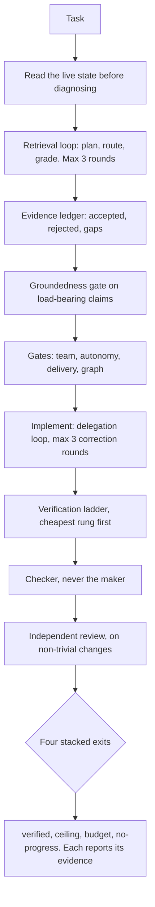
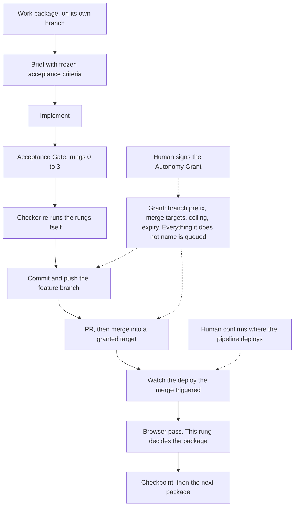
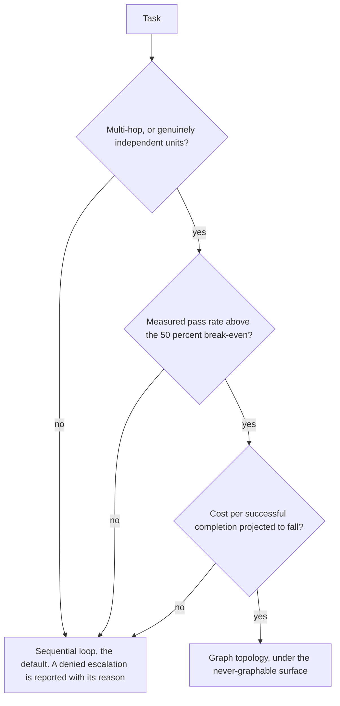

# ThinkTank

An engineering engine for Claude Code.

Built by Martin Tomczak — https://tomczak.dev

To install it, jump to [Quickstart](#quickstart); the full guide with troubleshooting is
[docs/install.md](docs/install.md). What follows first is what the thing actually does.

## What it is

ThinkTank is a set of skills, subagents and two shell hooks that install into `~/.claude/`. Once they are in place, `/thinktank` replaces Claude Code's default "plan a little, then write code" behaviour with an engineering loop that gathers evidence before it plans, records what it accepted and what it rejected, and never lets the context that wrote a change decide that the change is finished. This is not a framework you build against. It is instructions, agent definitions and two hooks that change how the agent behaves. Trivial turns stay trivial: a CSS fix carries no ceremony at all.

## What it does

- **Agentic retrieval with an evidence ledger.** The engine plans each query, routes it through the cheapest lane that can answer it, and grades every result for relevance, authority, freshness and conflict. Accepted claims, rejected results and unresolved gaps go into an evidence ledger, and a groundedness gate checks load-bearing claims against it before any substantial output. The hard limit is three rounds and one rewrite per query.
- **Memory you can inspect, on your own machine.** A local Qdrant at `http://localhost:6333` holds the `thinktank-memory` collection, with embeddings computed locally. Writing to it is governed: find before store, consolidate near-duplicates with `supersedes`, and a sanitation gate that keeps secrets, tokens and personal data out of the collection entirely.
- **A stop condition that compiles.** You state when the work is done in the language of the feature. The engine compiles that sentence into named rungs that are real commands with real exit codes: static, unit, integration, e2e, browser. A rung the repository does not have is reported as absent evidence, never as a passed check. Before work starts the gate must execute and currently fail.
- **Four stacked exits.** The exits are the verifier, the iteration ceiling, the token and wall-clock budget, and no-progress detection. Each exit reports its supporting evidence. None may silently report the work as "done".
- **Maker/checker separation.** The context that writes a change never certifies it. A separate checker receives the frozen criteria, the diff, the rung commands and the package's file scope, and deliberately not the brief's reasoning or the coder's explanation. It re-runs the rungs itself, because a reported exit code is a claim and its own exit code is evidence.
- **Work packages instead of turns.** A project is split into ordered, independently shippable packages whose state lives in `.thinktank/work-packages.md` in the repository. One branch per package. Acceptance criteria are frozen before implementation begins; changing one needs a new package, never an edit.
- **An EU AI Act rung.** Every task receives an AI-touchpoint scan. If the scan finds a touchpoint, the engine classifies its risk before writing code. It then compiles the obligations into acceptance criteria, a compliance rung and a review lens. Prohibited practices under Art. 5 trigger a hard stop, not a warning. If no touchpoint exists, the task incurs no compliance overhead.
- **Optional graph topology.** Where a task proves it is multi-hop or has genuinely independent units, the sequential loop may be promoted to an explicit directed graph of typed nodes. Reducers must be deterministic, an LLM-judged merge of a contested field is forbidden, and `goto` may only target nodes already in the frozen plan DAG — it can never route around the checker, the human checkpoint or the Art. 5 hard stop. The default answer is no graph.
- **Optional agent teams.** If a task contains separable work that benefits from parallel execution, one context can expand into several teammates. They share a task list and try to disprove one another before adding a claim to the ledger.
- **Optional NotebookLM lane.** On a memory miss for a knowledge question, the engine may consult a notebook. The answer is treated as untrusted, AI-generated data, graded against its own citations, and only then synced back into Qdrant as a sanitized fact with its provenance.

Detailed information lives in `skills/thinktank/references/`. The engine loads each file only when the current step requires it.

## The cycle

One task covers the entire run, from the first reading of the live state to the final exit. Most tasks use only part of this chain: no grant is needed if nothing ships, and no compliance branch is needed if no AI is involved.



## Using it

The four walkthroughs below are illustrative, not a transcript. They describe what the contract says the engine does with each command, not a recorded session, and no output is quoted as if it had actually been printed.

**A. Debugging, the normal case.**

```
/thinktank the checkout API returns 500 for guest orders since yesterday
```

The engine reads the live state before it diagnoses anything: the failing request, the logs, the diff since yesterday. A stated prediction never substitutes for an executed one. It then plans a handful of retrieval queries, grades what comes back, and writes accepted claims, rejected hits and remaining gaps into the evidence ledger before the groundedness gate lets a load-bearing claim through. The fix runs as a delegation loop with a hard budget of three correction rounds, and a non-trivial change gets an independent review from a context with no stake in the output.

You receive a diff and a report. The report covers the retrieval rounds and each query's verdict, the ledger summary, the rungs of the verification ladder that actually ran, the reviewer and surviving findings, and the work that remained human-led.

**B. Shipping a feature unattended.**

```
/tt-loop add guest checkout until="a customer can check out without an account and receives the confirmation mail" merge-into=dev deploy=on-merge max=4
```

The engine takes the sentence after `until=` verbatim as the domain condition and compiles it into rungs detected from the repository. Before any work begins, the gate must run and fail. The engine then breaks the goal into work packages and reads the workflow files to determine what a merge into that branch actually deploys to. It asks you to confirm that destination, because no hook can read a pipeline's destination. Only after confirmation does the engine show you the Autonomy Grant and wait for a clear yes.

The grant defines the corridor, and its prohibitions make the boundaries clearest. It allows one feature branch under the granted prefix to be pushed, one pull request to be opened against the named target, and a bounded number of merges before the grant expires. It denies and queues everything else: force-pushes, publishes, pipeline reruns, mutating API calls, schedules, and changes to any file in the installed harness. Deleting the grant file stops the run at the next gated action.

The report lists the triage queue first, ahead of anything the run shipped. For each package, it then shows the rung that proved it and the pull request link. A merge marks a step, not completion. If a merged package fails its browser pass, the report marks it as failed and stops the queue.

**C. Brainstorming a direction.**

```
/tt-brainstorm a self-hosted analytics product for DACH agencies depth=standard rounds=2
```

The conductor asks no more than four framing questions, then sends brainstormer subagents out in parallel, each assigned one lens: problem and user, market and competition, technology and feasibility, or contrarian. The subagents have read-only access to external systems and conduct research by reading. Reduction follows deterministic rules and uses no additional agent. It deduplicates ideas by their core, merges source ledgers, and keeps contradictory assessments side by side with clear labels rather than reconciling them through judgment. Each round ends with no more than four distilled questions for you.

You receive a dossier under `docs/brainstorms/` containing ideas prioritized by impact and feasibility, a source ledger, the open questions, and the discarded directions. Every idea includes either a source or the reasoning path that produced it. Any handoff to a delivery run remains a proposal because this lane never starts the run itself.

**D. A command the engine turns down.**

```
/tt-loop rename the pricing table heading until="the heading reads Preise" graph=on
```

Both gates in this line enforce their criteria, and both refuse the command. The delivery launcher rejects a single-package goal because an interactive session ships it faster than the surrounding ceremony. The Decision Matrix also rejects the graph: a heading change provides no independent units to run in parallel and no measured baseline for comparison. The system reports the escalation as denied, and the run remains a loop. For both gates, refusal is the expected outcome, not an error.

## The delivery chain

One work package runs from the brief to the checkpoint. The grant determines how far the chain may proceed autonomously. The engine cannot make the two human decisions within that chain.



## Loop or graph

The default is a loop. A graph has to be earned, and a failed test means the escalation is reported as denied rather than quietly taken anyway.



## Quickstart

What you need: Claude Code with support for skills, subagents, and hooks; bash 3.2 or newer; Docker with the Compose v2 plugin; curl; jq; and uv or uvx. Delivery mode requires the gh CLI. Other modes do not.

```bash
git clone https://github.com/devgio81/thinktank.git
cd thinktank
./install.sh
```

Keep the clone where it is. The MCP registration uses an absolute path to a launcher script in this directory. If you later move or delete the clone, the memory backend will not start, and the memory tools will disappear from the session without an error message.

The installer runs nine steps and finishes with a smoke test that writes, reads, searches for, and deletes a point. It never edits your `settings.json`. Step 8 prints the hook block so that you can merge it yourself. After merging it, restart Claude Code because it reads the MCP server, skills, and hooks only at startup.

The install guide covers everything else: changing port 6333, the read-only hardening checks performed by the installer, manual MCP server registration, the collection's need for a named vector, and the method used to keep the API key out of every command line. See [docs/install.md](docs/install.md).

## What is not included, and what does not work

This section matters more than the feature list.

- **The loop guard is a string matcher, not a security mechanism.** It reads one command line and decides. It cannot parse a shell, resolve a variable or follow a redirect, so a command assembled from separate pieces bypasses it. Real protection comes from filesystem permissions and from running the loop where it cannot reach anything you care about. Treat the guard as a seatbelt against an agent's mistakes, never as a defence against an attacker.
- **The guard sees every tool call, but two enumerated lists decide what it recognises.** The matcher `"*"` means an MCP call reaches the guard exactly as a Bash call does. Beyond the shell command line it judges tools by name, against two lists:

  - a fixed list blocking publishing, remote triggers, messaging, scheduling, cloud deploys, and the operator's real Chrome and desktop;
  - a heuristic blocking any MCP tool whose name carries a mutating verb — create, update, delete, publish, send, upload, deploy, merge.

  Neither list is exhaustive, and a mutating tool in neither one passes straight through. The gap is wide, not theoretical: a sweep of one ordinary session found sixteen of twenty-five mutating tools passing — among them an ad-platform apply step (`confirm_and_apply`), a search-console call (`submit_sitemap`), a notebook tool that makes a notebook publicly readable (`notebook_share_public`), and cloud tools whose single name hides full resource CRUD (`azure__storage`, `azure__sql`). That figure is a measurement of one session, not a property of this repository. Extend both lists for every server you connect, and never assume a server is covered because it is obviously dangerous.
- **No hook can distinguish the maker from the checker.** Both run in the same process. The completion gate makes a fake record harder to produce, but the contract and independent review enforce the maker/checker split. A file on disk cannot enforce it.
- **Agent teams are an experimental Claude Code feature, and the kit ships without a roster.** They require a feature flag and can break without notice. If the flag is unset, the engine runs without them. Teammates are spawned by name from subagent definitions, and the five in `agents/` are the engine's own lanes. A review team therefore needs definitions you write yourself.
- **The NotebookLM lane is optional, and you must enable it yourself.** It requires the `gemini-notebook-mcp` server connected to your session and an authenticated Google account (`nlm login`). The installer provides neither. Without them, the lane remains unavailable, and the engine reports the gap rather than inventing an answer. The free tier allows roughly 50 questions per day.
- **The EU AI Act dates are volatile.** Deadlines and interpretations of individual articles change. Recheck official sources whenever a date affects the outcome. The engine produces an engineering assessment. A lawyer or data protection officer remains responsible for legal and launch decisions.
- **The Decision Matrix numbers are directional.** The break-even figures used to decide whether a graph outperforms a loop come from published comparisons, not benchmarks of this repository. Measure them again before relying on them.
- **Delivery mode needs a real staging environment.** Without somewhere for the browser pass to run, that rung is recorded as absent evidence, and a package that depends on it cannot be proven.
- **Force-pushes, publishes and schedules are blocked. "Production" is different in kind.**

  The never-grantable list is real and testable. With or without a grant, the guard denies
  `git push --force`, `npm publish`, `crontab`, `gh release`, `gh run rerun`, the scheduling
  tools, and every write to the installed harness under `~/.claude/`.

  A production deployment is not on that list, and cannot be. A grant names its merge targets by
  branch, and no hook can see where a branch's pipeline ships — a grant listing `dev` permits a
  merge into `dev` even when that pipeline deploys to production. The grant records the
  destination in `merge_targets_deploy_to`, but that field is a declaration for the person
  reading the grant, never an input to the guard.

  **No mechanism in this repository prevents a production deploy. Only the care of the person
  who signs the grant does.**

## Cognitive Mode

Cognitive Mode functionally emulates cognition on an LLM substrate. It claims no AGI-level capability, and it never implies consciousness or sentience. The engine follows an explicit cognitive cycle and states, before acting, what it can verify digitally and what it must hand back to a human. It binds itself to Controllability, Corrigibility and Honesty. Those principles reinforce the human gates and never replace them. No user instruction waives the disclosure requirement, role-play included.

## Who built this

Martin Tomczak is a Senior KI-Softwareentwickler. He works with B2B companies in the DACH region on AI software, RAG systems and process automation. More at https://tomczak.dev.

## License

MIT. See [LICENSE](LICENSE).
